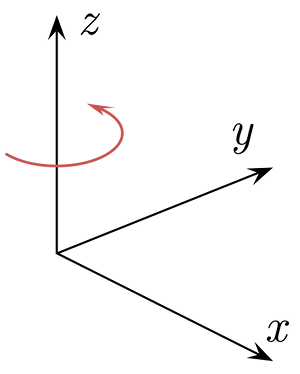
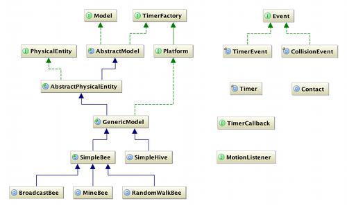
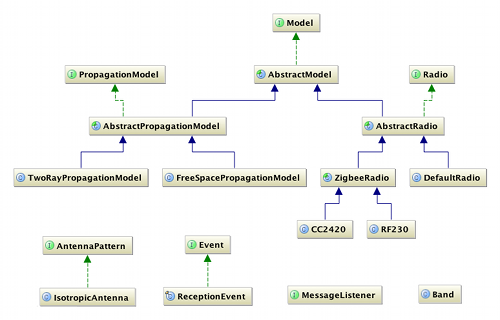

# Simbeeotic Modeling Guide

Simbeeotic is built on top of the JBullet physics engine and adopts some of its conventions. To begin with, coordinates are expressed using a right-handed coordinate system (pictured below) in which rotations are counter-clockwise about each axis.

In Simbeeotic we usually refer to two reference frames, the world frame and the body frame. The origin of the world frame is placed at an arbitrary point on the surface of the earth and is oriented such that the X axis points North, the Y axis West, and the Z axis orthogonally away from the ground plane. All objects start aligned with the world reference frame. As a convention, the body frame is oriented such that the X axis is aligned along the principle body axis. If you think of an aircraft, this means that the X axis points "out the nose", the Y axis "out the left wing", and the Z axis points "out the top", or "away from the ground" when flying upright.

Simbeeotic uses SI units only. Generally, distance is measured in meters, mass in grams, time in seconds, power in milliWatts, and angles in radians (except for compass readings).

## Model Hierarchy
Simbeeotic is designed to be extensible at multiple levels. The key interfaces are Model and PhysicalEntity. The former defines logical presence in the simulation, whereas the latter defines physical presence. The following UML class diagram shows how these interfaces are used within the simulation framework.

There are multiple extension points in the framework that can be used by modelers to add functionality. Depending on the fidelity of your simulation, you may wish to define new models at multiple extension points. If you can live with a simplified movement interface, you may derive from `SimpleBee`. However, you may wish to have finer control over the forces acting on your model, so you may use `GenericModel` or `AbstractPhysicalEntity` as your base. There are fewer convenience mechanisms as you go up the model hierarchy and it is more probable that you will make a mistake in constructing your model. We suggest that you begin by extending the class with the most level of abstraction you may need (e.g. `SimpleBee` or `GenericModel`) and work your way up if more control is needed.

While Simbeeotic is a discrete event simulation under the covers, users will not generally schedule events directly. We have provided a familiar `Timer` interface that modelers can use to schedule periodic or one-off timer interrupts on their model (with custom callbacks). 

### SimpleBee
A good example of a MAV with a simple movement interface is `SimpleBee` (remember, this simulator started from the RoboBees project). Users can customize the behavior of a derived class by overriding the `updateKinematics` method, which is called periodically to update the motion of the model. From this method, the user can command the model to:

* **turn** - Instantaneously rotate about the Z axis by a fixed amount. There is only one degree of freedom since the other axes are snapped in place to simulate "level flight".
* **turnToward** - Instantaneously rotate the body so that the X axis (in the body frame) is pointing toward a point in space (in the world frame).
* **setDesiredLinearVelocity** - Sets the linear velocity of the bee. Once set (in the body frame), the bee will attempt to maintain the given velocity until reset. This setting takes effect at the next time step. There are no restrictions in the direction of the velocity applied, meaning that the bee can move in arbitrary directions.
* **hover** - Indicates if gravity should be automatically counteracted. If true, a force equal to gravity is constantly applied, allowing the body to hover in place even if no linear velocity is set and the body is not at rest. If the bee is not in hover mode, gravity will be applied as normal.

If this movement API is too primitive, users are free to disregard the `SimpleBee` and instead extend from `GenericModel` or `AbstractPhysicalEntity` and apply forces and torques to the model's body directly. 

### Sensors
There are a number of sensors available to modelers for use within their bee implementations. Default implementations, which mostly use noised truth values for readings, are provided. More sophisticated, realistic sensors are left as exercises for the user.

### RF
There are three major interfaces the the comms system, `Radio`, `AntennaPattern`, and `PropagationModel`. The radio is the component that is attached to a model in the simulation (like a MAV) and the propagation model ties the radios together by propagating transmitted messages through a simulated medium and delivering them to recipients. The following UML diagram partially depicts the comms classes:

Users are free to create new radios, antennas, or propagation models to suit their needs. The radio only defines a simple physical layer abstraction. Networking protocols can be built atop this layer, but are left as exercises for the user.